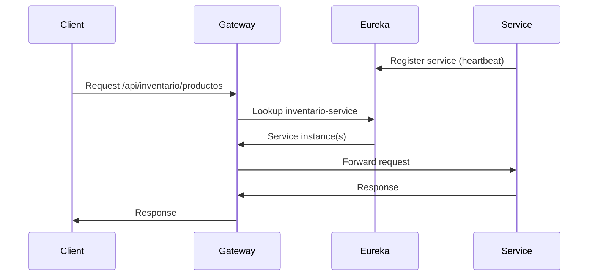
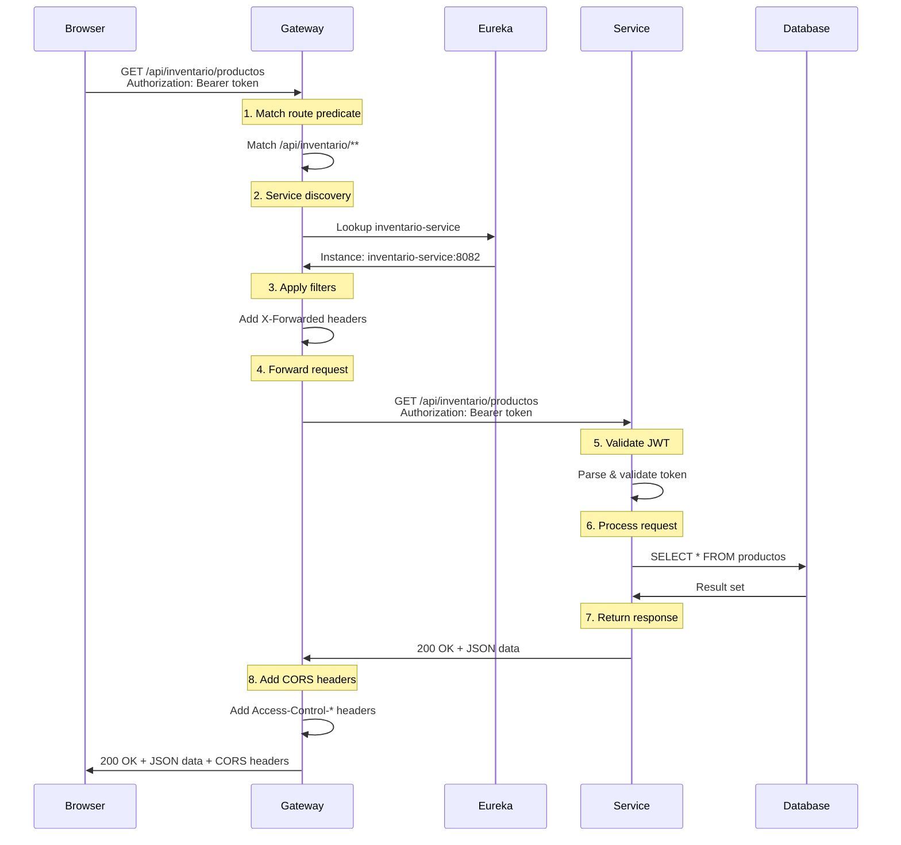

## Overview

The Fluxora API Gateway serves as the central entry point for all client requests, built on **Spring Cloud Gateway** with WebFlux for reactive, non-blocking request handling.

<Card title="Gateway Responsibilities" icon="network-wired">
- **Request Routing** - Direct requests to appropriate microservices
- **Service Discovery** - Integration with Eureka for dynamic service location
- **CORS Management** - Cross-origin resource sharing configuration
- **Load Balancing** - Distribute requests across service instances
- **Unified Entry Point** - Single API endpoint for all microservices
</Card>

## Gateway Configuration

The gateway runs on **port 8080** and is configured via `application.properties`.

### Basic Configuration

```properties
spring.application.name=microservice-gateway
server.port=8080
spring.cloud.gateway.server.webflux.discovery.locator.enabled=true
spring.cloud.gateway.server.webflux.discovery.locator.lower-case-service-id=true

spring.main.web-application-type=reactive
```

<ParamField path="server.port" type="number" default="8080">
  Port on which the Gateway listens for incoming requests
</ParamField>

<ParamField path="spring.cloud.gateway.server.webflux.discovery.locator.enabled" type="boolean" default="true">
  Enables automatic route creation based on services registered with Eureka
</ParamField>

<ParamField path="spring.cloud.gateway.server.webflux.discovery.locator.lower-case-service-id" type="boolean" default="true">
  Converts service IDs to lowercase for URL routing
</ParamField>

<ParamField path="spring.main.web-application-type" type="string" default="reactive">
  Configures Spring Boot to use reactive WebFlux instead of traditional servlet model
</ParamField>

## Route Configuration

The Gateway defines explicit routes to each microservice using path-based predicates.

### Route Structure

Each route consists of:
- **ID** - Unique route identifier
- **URI** - Target microservice location
- **Predicates** - Conditions to match incoming requests
- **Filters** - Request/response transformations

### Configured Routes

<AccordionGroup>
  <Accordion title="Usuario Service Route" icon="user">
    ```properties
    spring.cloud.gateway.server.webflux.routes[0].id=usuarios
    spring.cloud.gateway.server.webflux.routes[0].uri=http://usuario-service:8081
    spring.cloud.gateway.server.webflux.routes[0].predicates[0]=Path=/api/usuarios/**
    spring.cloud.gateway.server.webflux.routes[0].filters[0]=StripPrefix=0
    ```
    
    **Routing Logic:**
    - Matches: `/api/usuarios/**`
    - Forwards to: `http://usuario-service:8081/api/usuarios/**`
    - Examples:
      - `GET /api/usuarios/usuarios` → `http://usuario-service:8081/api/usuarios/usuarios`
      - `POST /api/usuarios/auth/login` → `http://usuario-service:8081/api/usuarios/auth/login`
  </Accordion>

  <Accordion title="Inventario Service Route" icon="boxes-stacked">
    ```properties
    spring.cloud.gateway.server.webflux.routes[1].id=inventario
    spring.cloud.gateway.server.webflux.routes[1].uri=http://inventario-service:8082
    spring.cloud.gateway.server.webflux.routes[1].predicates[0]=Path=/api/inventario/**
    spring.cloud.gateway.server.webflux.routes[1].filters[0]=StripPrefix=0
    ```
    
    **Routing Logic:**
    - Matches: `/api/inventario/**`
    - Forwards to: `http://inventario-service:8082/api/inventario/**`
    - Examples:
      - `GET /api/inventario/productos` → `http://inventario-service:8082/api/inventario/productos`
      - `POST /api/inventario/lotes` → `http://inventario-service:8082/api/inventario/lotes`
  </Accordion>

  <Accordion title="Cliente Service Route" icon="address-book">
    ```properties
    spring.cloud.gateway.server.webflux.routes[2].id=clientes
    spring.cloud.gateway.server.webflux.routes[2].uri=http://cliente-service:8083
    spring.cloud.gateway.server.webflux.routes[2].predicates[0]=Path=/api/clientes/**
    spring.cloud.gateway.server.webflux.routes[2].filters[0]=StripPrefix=0
    ```
    
    **Routing Logic:**
    - Matches: `/api/clientes/**`
    - Forwards to: `http://cliente-service:8083/api/clientes/**`
    - Examples:
      - `GET /api/clientes/clientes` → `http://cliente-service:8083/api/clientes/clientes`
      - `POST /api/clientes/clientes` → `http://cliente-service:8083/api/clientes/clientes`
  </Accordion>

  <Accordion title="Entrega Service Route" icon="truck">
    ```properties
    spring.cloud.gateway.server.webflux.routes[3].id=entregas
    spring.cloud.gateway.server.webflux.routes[3].uri=http://entrega-service:8084
    spring.cloud.gateway.server.webflux.routes[3].predicates[0]=Path=/api/entregas/**
    spring.cloud.gateway.server.webflux.routes[3].filters[0]=StripPrefix=0
    ```
    
    **Routing Logic:**
    - Matches: `/api/entregas/**`
    - Forwards to: `http://entrega-service:8084/api/entregas/**`
    - Examples:
      - `GET /api/entregas/rutas-activas` → `http://entrega-service:8084/api/entregas/rutas-activas`
      - `POST /api/entregas/registrar` → `http://entrega-service:8084/api/entregas/registrar`
  </Accordion>
</AccordionGroup>

### StripPrefix Filter

The `StripPrefix=0` filter configuration means:
- **0** - Do not strip any path segments
- The full path is forwarded to the microservice

<Note>
If `StripPrefix=1` was used, the first path segment would be removed. For example, `/api/usuarios/usuarios` would become `/usuarios/usuarios`.
</Note>

## Service Discovery with Eureka

The Gateway integrates with Netflix Eureka for dynamic service discovery.

### Eureka Configuration

```properties
eureka.client.service-url.defaultZone=http://eureka-server:8761/eureka/
eureka.client.fetch-registry=true
eureka.client.register-with-eureka=true
eureka.instance.prefer-ip-address=true
eureka.instance.ip-address=127.0.0.1
eureka.instance.hostname=localhost
```

<ParamField path="eureka.client.service-url.defaultZone" type="string" required>
  URL of the Eureka server for service registration and discovery
</ParamField>

<ParamField path="eureka.client.fetch-registry" type="boolean" default="true">
  Whether the Gateway should fetch the service registry from Eureka
</ParamField>

<ParamField path="eureka.client.register-with-eureka" type="boolean" default="true">
  Whether the Gateway should register itself with Eureka
</ParamField>

<ParamField path="eureka.instance.prefer-ip-address" type="boolean" default="true">
  Use IP address instead of hostname for service registration
</ParamField>

### Service Discovery Flow



### Benefits of Service Discovery

<CardGroup cols={2}>
  <Card title="Dynamic Scaling" icon="arrows-up-down">
    Services can scale up or down without Gateway reconfiguration
  </Card>
  <Card title="Load Balancing" icon="scale-balanced">
    Requests distributed across multiple service instances
  </Card>
  <Card title="Health Monitoring" icon="heartbeat">
    Eureka tracks service health and removes failed instances
  </Card>
  <Card title="Zero Downtime" icon="clock">
    New service versions can be deployed without downtime
  </Card>
</CardGroup>

## CORS Configuration

The Gateway handles Cross-Origin Resource Sharing (CORS) globally for all routes.

### CORS Settings

```properties
spring.cloud.gateway.server.webflux.globalcors.cors-configurations.[/**].allowed-origins=http://localhost:3000,https://fluxora.uno
spring.cloud.gateway.server.webflux.globalcors.cors-configurations.[/**].allowed-methods=GET,POST,PUT,PATCH,DELETE,OPTIONS
spring.cloud.gateway.server.webflux.globalcors.cors-configurations.[/**].allowed-headers=Authorization,Content-Type,Accept,X-Requested-With
spring.cloud.gateway.server.webflux.globalcors.cors-configurations.[/**].allow-credentials=true
spring.cloud.gateway.server.webflux.globalcors.cors-configurations.[/**].max-age=3600
```

### CORS Parameters

<ParamField path="allowed-origins" type="string" required>
  Comma-separated list of allowed origins
  - Development: `http://localhost:3000`
  - Production: `https://fluxora.uno`
</ParamField>

<ParamField path="allowed-methods" type="string" required>
  HTTP methods permitted for cross-origin requests
  - `GET, POST, PUT, PATCH, DELETE, OPTIONS`
</ParamField>

<ParamField path="allowed-headers" type="string" required>
  Headers that can be used in actual requests
  - `Authorization` - JWT tokens
  - `Content-Type` - Request body format
  - `Accept` - Response format preference
  - `X-Requested-With` - AJAX request indicator
</ParamField>

<ParamField path="allow-credentials" type="boolean" default="true">
  Allow cookies and authorization headers in cross-origin requests
</ParamField>

<ParamField path="max-age" type="number" default="3600">
  Seconds to cache preflight request results (1 hour)
</ParamField>

### Preflight Requests

Browsers send OPTIONS requests before actual requests to check CORS permissions:

```bash
# Browser automatically sends preflight
OPTIONS /api/inventario/productos HTTP/1.1
Host: localhost:8080
Origin: http://localhost:3000
Access-Control-Request-Method: GET
Access-Control-Request-Headers: Authorization,Content-Type

# Gateway responds with CORS headers
HTTP/1.1 200 OK
Access-Control-Allow-Origin: http://localhost:3000
Access-Control-Allow-Methods: GET,POST,PUT,PATCH,DELETE,OPTIONS
Access-Control-Allow-Headers: Authorization,Content-Type,Accept,X-Requested-With
Access-Control-Allow-Credentials: true
Access-Control-Max-Age: 3600
```

<Warning>
If your frontend runs on a different origin (e.g., `http://localhost:4000`), you must add it to `allowed-origins` or use `*` for development (not recommended for production).
</Warning>

## Load Balancing

When multiple instances of a service are registered with Eureka, the Gateway automatically load balances requests.

### Load Balancing Strategy

Spring Cloud Gateway uses **Round Robin** load balancing by default:

```
Request 1 → inventario-service instance 1
Request 2 → inventario-service instance 2
Request 3 → inventario-service instance 1
...
```

### Example: Multiple Service Instances

```
┌──────────────┐
│   Gateway    │
│  Port 8080   │
└──────┬───────┘
       │
       ├─────► inventario-service:8082 (Instance 1)
       ├─────► inventario-service:8083 (Instance 2)
       └─────► inventario-service:8084 (Instance 3)
```

## Request/Response Flow

### Complete Request Lifecycle



### Request Headers Added by Gateway

The Gateway automatically adds forwarding headers:

```
X-Forwarded-For: client-ip-address
X-Forwarded-Proto: http
X-Forwarded-Port: 8080
X-Forwarded-Host: localhost:8080
```

## Error Handling

### Gateway Errors

The Gateway may return errors before reaching the target service:

**Service Unavailable (503):**

```json
{
  "timestamp": "2026-03-13T10:30:00",
  "status": 503,
  "error": "Service Unavailable",
  "message": "No instances available for inventario-service",
  "path": "/api/inventario/productos"
}
```

**Gateway Timeout (504):**

```json
{
  "timestamp": "2026-03-13T10:30:00",
  "status": 504,
  "error": "Gateway Timeout",
  "message": "Response timeout",
  "path": "/api/inventario/productos"
}
```

**Not Found (404):**

```json
{
  "timestamp": "2026-03-13T10:30:00",
  "status": 404,
  "error": "Not Found",
  "message": "No route found for /api/invalid/path",
  "path": "/api/invalid/path"
}
```

## Monitoring and Debugging

### View Registered Routes

Access the Gateway actuator endpoint (if enabled):

```bash
curl http://localhost:8080/actuator/gateway/routes
```

### View Registered Services

Check Eureka dashboard:

```
http://localhost:8761
```

### Enable Debug Logging

Add to `application.properties`:

```properties
logging.level.org.springframework.cloud.gateway=DEBUG
logging.level.reactor.netty=DEBUG
```

## Performance Considerations

<Card title="Reactive Performance Benefits" icon="bolt">
- **Non-Blocking I/O** - Handles thousands of concurrent connections
- **Efficient Resource Usage** - Lower memory footprint than servlet-based gateways
- **Backpressure Support** - Prevents overwhelming downstream services
- **Async Processing** - Requests don't block threads while waiting
</Card>

### Resource Configuration

```properties
# Disable static resource handling (not needed for API gateway)
spring.web.resources.add-mappings=false
```

## Security Considerations

<Warning>
**Gateway Security Best Practices:**

1. The Gateway does NOT validate JWT tokens - this is done by each microservice
2. CORS configuration should be restrictive in production (avoid `*`)
3. Use HTTPS/TLS in production environments
4. Implement rate limiting for DDoS protection (not currently configured)
5. Monitor Gateway logs for suspicious activity
</Warning>

## Configuration Reference

Full gateway configuration from `application.properties:1-48`:

| Property | Value | Purpose |
|----------|-------|----------|
| `server.port` | 8080 | Gateway listening port |
| `spring.application.name` | microservice-gateway | Service identifier |
| `spring.main.web-application-type` | reactive | Use WebFlux framework |
| **Route: usuarios** | http://usuario-service:8081 | Auth & user management |
| **Route: inventario** | http://inventario-service:8082 | Inventory operations |
| **Route: clientes** | http://cliente-service:8083 | Client management |
| **Route: entregas** | http://entrega-service:8084 | Delivery operations |
| **Eureka Zone** | http://eureka-server:8761/eureka/ | Service registry |
| **CORS Origins** | http://localhost:3000, https://fluxora.uno | Allowed client origins |
| **CORS Max Age** | 3600 | Preflight cache duration |

## Next Steps

<CardGroup cols={2}>
  <Card title="API Overview" icon="book" href="/api/overview">
    Understand API conventions and response formats
  </Card>
  <Card title="Authentication" icon="lock" href="/api/authentication">
    Learn JWT authentication and authorization
  </Card>
  <Card title="Service Architecture" icon="diagram-project" href="/development/microservices-architecture">
    Explore microservices architecture
  </Card>
  <Card title="Deployment" icon="rocket" href="/deployment/docker">
    Deploy Gateway with Docker
  </Card>
</CardGroup>