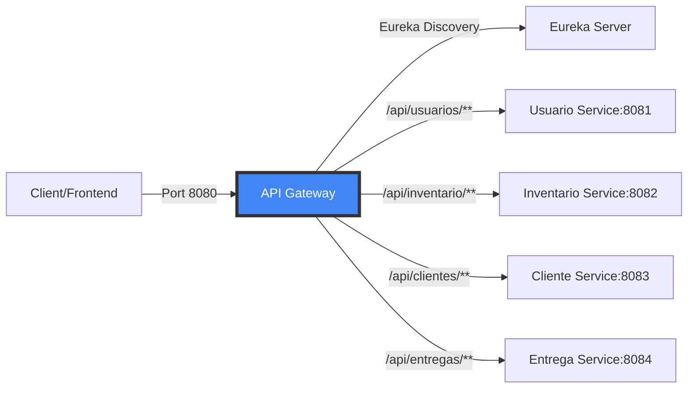
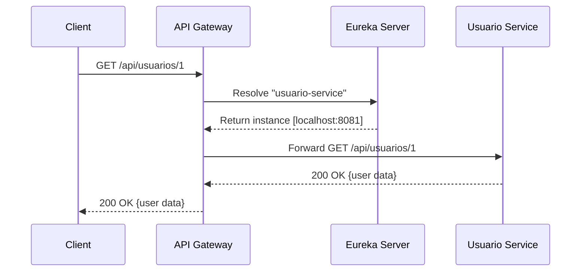
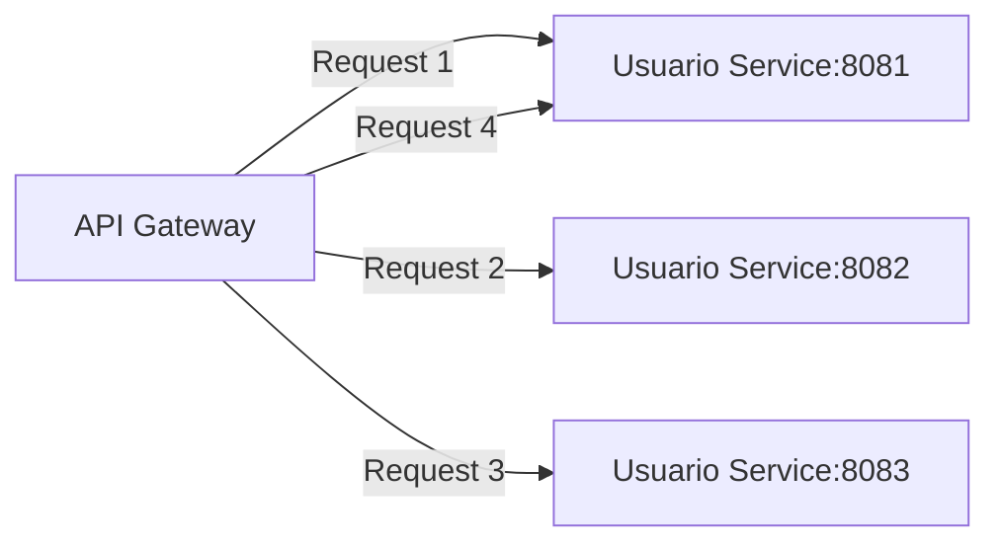

## Overview

Fluxora uses **Spring Cloud Gateway** as the single entry point for all client requests. The gateway handles routing, CORS, load balancing, and service discovery integration, providing a unified API interface that abstracts the underlying microservices architecture.

<Note>
  The API Gateway runs on port **8080** and uses reactive programming with Spring WebFlux for high-performance, non-blocking request handling.
</Note>

## Why Use an API Gateway?

<CardGroup cols={2}>
  <Card title="Single Entry Point" icon="door-open">
    Clients interact with one endpoint instead of multiple microservice URLs
  </Card>
  <Card title="Cross-Cutting Concerns" icon="scissors">
    Centralized CORS, authentication, rate limiting, and logging
  </Card>
  <Card title="Service Abstraction" icon="masks-theater">
    Internal service topology changes don't affect clients
  </Card>
  <Card title="Load Balancing" icon="scale-balanced">
    Automatic distribution of requests across service instances
  </Card>
</CardGroup>

## Architecture



## Gateway Configuration

### Dependencies

The gateway uses Spring Cloud Gateway and Eureka Client:

```xml
<properties>
    <java.version>21</java.version>
    <spring-cloud.version>2025.0.0</spring-cloud.version>
</properties>

<dependencies>
    <!-- Spring Cloud Gateway (Reactive) -->
    <dependency>
        <groupId>org.springframework.cloud</groupId>
        <artifactId>spring-cloud-starter-gateway</artifactId>
    </dependency>
    
    <!-- Service Discovery -->
    <dependency>
        <groupId>org.springframework.cloud</groupId>
        <artifactId>spring-cloud-starter-netflix-eureka-client</artifactId>
    </dependency>
    
    <!-- Reactive Web -->
    <dependency>
        <groupId>org.springframework.boot</groupId>
        <artifactId>spring-boot-starter-web</artifactId>
    </dependency>
</dependencies>
```

**Source**: `~/workspace/source/Microservicios/microservice-gateway/pom.xml:42`

### Application Configuration

```properties
spring.application.name=microservice-gateway
server.port=8080
spring.cloud.gateway.server.webflux.discovery.locator.enabled=true
spring.cloud.gateway.server.webflux.discovery.locator.lower-case-service-id=true

spring.main.web-application-type=reactive
```

**Source**: `~/workspace/source/Microservicios/microservice-gateway/src/main/resources/application.properties:1`

<AccordionGroup>
  <Accordion title="discovery.locator.enabled=true">
    Enables automatic route creation based on services registered in Eureka
  </Accordion>
  
  <Accordion title="lower-case-service-id=true">
    Converts service names to lowercase for URL routing (e.g., `MICROSERVICE-USUARIO` becomes `microservice-usuario`)
  </Accordion>
  
  <Accordion title="web-application-type=reactive">
    Forces Spring Boot to use reactive (WebFlux) mode instead of servlet-based (required for Gateway)
  </Accordion>
</AccordionGroup>

## Route Configuration

Fluxora defines explicit routes for each microservice in `application.properties`:

### Route 1: Usuario Service

```properties
# Ruta usuarios
spring.cloud.gateway.server.webflux.routes[0].id=usuarios
spring.cloud.gateway.server.webflux.routes[0].uri=http://usuario-service:8081
spring.cloud.gateway.server.webflux.routes[0].predicates[0]=Path=/api/usuarios/**
spring.cloud.gateway.server.webflux.routes[0].filters[0]=StripPrefix=0
```

**Source**: `~/workspace/source/Microservicios/microservice-gateway/src/main/resources/application.properties:10`

### Route 2: Inventario Service

```properties
# Configuración de rutas para el microservicio de inventario
spring.cloud.gateway.server.webflux.routes[1].id=inventario
spring.cloud.gateway.server.webflux.routes[1].uri=http://inventario-service:8082
spring.cloud.gateway.server.webflux.routes[1].predicates[0]=Path=/api/inventario/**
spring.cloud.gateway.server.webflux.routes[1].filters[0]=StripPrefix=0
```

**Source**: `~/workspace/source/Microservicios/microservice-gateway/src/main/resources/application.properties:16`

### Route 3: Cliente Service

```properties
# Ruta clientes
spring.cloud.gateway.server.webflux.routes[2].id=clientes
spring.cloud.gateway.server.webflux.routes[2].uri=http://cliente-service:8083
spring.cloud.gateway.server.webflux.routes[2].predicates[0]=Path=/api/clientes/**
spring.cloud.gateway.server.webflux.routes[2].filters[0]=StripPrefix=0
```

**Source**: `~/workspace/source/Microservicios/microservice-gateway/src/main/resources/application.properties:22`

### Route 4: Entrega Service

```properties
# Ruta Entrega
spring.cloud.gateway.server.webflux.routes[3].id=entregas
spring.cloud.gateway.server.webflux.routes[3].uri=http://entrega-service:8084
spring.cloud.gateway.server.webflux.routes[3].predicates[0]=Path=/api/entregas/**
spring.cloud.gateway.server.webflux.routes[3].filters[0]=StripPrefix=0
```

**Source**: `~/workspace/source/Microservicios/microservice-gateway/src/main/resources/application.properties:28`

### Route Properties Explained

| Property | Description | Example |
|----------|-------------|----------|
| `id` | Unique identifier for the route | `usuarios` |
| `uri` | Backend service URL (hostname:port) | `http://usuario-service:8081` |
| `predicates[0]` | Request matching condition (path, header, method) | `Path=/api/usuarios/**` |
| `filters[0]` | Request/response transformation | `StripPrefix=0` |

<Note>
  `StripPrefix=0` means the full path (including `/api/usuarios`) is forwarded to the backend service. If set to `StripPrefix=1`, the first path segment would be removed.
</Note>

## CORS Configuration

The gateway handles Cross-Origin Resource Sharing (CORS) globally:

```properties
# CORS Configuration - Usa variable de entorno en producción
spring.cloud.gateway.server.webflux.globalcors.cors-configurations.[/**].allowed-origins=http://localhost:3000,https://fluxora.uno
spring.cloud.gateway.server.webflux.globalcors.cors-configurations.[/**].allowed-methods=GET,POST,PUT,PATCH,DELETE,OPTIONS
spring.cloud.gateway.server.webflux.globalcors.cors-configurations.[/**].allowed-headers=Authorization,Content-Type,Accept,X-Requested-With
spring.cloud.gateway.server.webflux.globalcors.cors-configurations.[/**].allow-credentials=true
spring.cloud.gateway.server.webflux.globalcors.cors-configurations.[/**].max-age=3600
```

**Source**: `~/workspace/source/Microservicios/microservice-gateway/src/main/resources/application.properties:43`

### CORS Settings Breakdown

<Steps>
  <Step title="Allowed Origins">
    Specifies which frontend domains can access the API:
    - `http://localhost:3000` - Development (React/Next.js)
    - `https://fluxora.uno` - Production domain
    
    <Warning>
      Never use `*` for `allowed-origins` in production when `allow-credentials=true`
    </Warning>
  </Step>
  
  <Step title="Allowed Methods">
    Permits standard HTTP methods for RESTful APIs:
    - `GET`, `POST`, `PUT`, `PATCH`, `DELETE`, `OPTIONS`
  </Step>
  
  <Step title="Allowed Headers">
    Specifies which headers the client can send:
    - `Authorization` - JWT tokens
    - `Content-Type` - Request body format
    - `Accept` - Response format preference
    - `X-Requested-With` - AJAX request indicator
  </Step>
  
  <Step title="Allow Credentials">
    Enables cookies and authorization headers in cross-origin requests (required for JWT authentication)
  </Step>
  
  <Step title="Max Age">
    Browsers cache preflight OPTIONS request results for 3600 seconds (1 hour)
  </Step>
</Steps>

## Eureka Integration

The gateway registers with Eureka and queries it for backend service locations:

```properties
eureka.client.service-url.defaultZone=http://eureka-server:8761/eureka/
eureka.client.fetch-registry=true
eureka.client.register-with-eureka=true
eureka.instance.prefer-ip-address=true
eureka.instance.ip-address=127.0.0.1
eureka.instance.hostname=localhost
```

**Source**: `~/workspace/source/Microservicios/microservice-gateway/src/main/resources/application.properties:36`

### Service Discovery Flow



## Request/Response Transformation

### Built-in Filters

Spring Cloud Gateway provides several built-in filters:

<AccordionGroup>
  <Accordion title="StripPrefix" icon="eraser">
    Removes path segments before forwarding to backend
    
    ```properties
    # StripPrefix=1 removes the first segment
    # /api/usuarios/1 → /usuarios/1
    filters[0]=StripPrefix=1
    ```
  </Accordion>
  
  <Accordion title="AddRequestHeader" icon="plus">
    Adds a header to the forwarded request
    
    ```properties
    filters[1]=AddRequestHeader=X-Gateway, Fluxora-Gateway
    ```
  </Accordion>
  
  <Accordion title="AddResponseHeader" icon="reply">
    Adds a header to the response sent to the client
    
    ```properties
    filters[2]=AddResponseHeader=X-Response-Time, ${response-time}
    ```
  </Accordion>
  
  <Accordion title="RewritePath" icon="pen-to-square">
    Transforms the request path using regex
    
    ```properties
    # /red/blue → /blue
    filters[3]=RewritePath=/red/(?<segment>.*), /$\{segment}
    ```
  </Accordion>
  
  <Accordion title="CircuitBreaker" icon="circle-nodes">
    Implements fallback logic for failing services (requires Resilience4j)
    
    ```properties
    filters[4]=CircuitBreaker=myCircuitBreaker
    ```
  </Accordion>
</AccordionGroup>

### Custom Filters (Future Enhancement)

You can create custom `GatewayFilter` implementations for:
- Request logging
- JWT validation
- Rate limiting
- Request tracing (correlation IDs)

**Example**: Custom logging filter

```java
@Component
public class LoggingFilter implements GlobalFilter, Ordered {
    @Override
    public Mono<Void> filter(ServerWebExchange exchange, GatewayFilterChain chain) {
        ServerHttpRequest request = exchange.getRequest();
        log.info("Request: {} {}", request.getMethod(), request.getURI());
        return chain.filter(exchange);
    }
    
    @Override
    public int getOrder() {
        return -1; // Execute first
    }
}
```

## Load Balancing

When multiple instances of a service are registered in Eureka, the gateway automatically load-balances requests:

### Round-Robin Load Balancing



### Enabling Load Balancing

<Note>
  Load balancing is automatically enabled when using Eureka service discovery with `uri` set to `lb://service-name`
</Note>

**Example**: Using load-balanced URIs

```properties
# Instead of hard-coded URLs
spring.cloud.gateway.routes[0].uri=http://usuario-service:8081

# Use load-balanced service discovery
spring.cloud.gateway.routes[0].uri=lb://microservice-usuario
```

The `lb://` prefix tells Spring Cloud Gateway to use client-side load balancing via Eureka.

## Testing Routes

### Test Usuario Service Route

```bash
curl -X GET http://localhost:8080/api/usuarios \
  -H "Authorization: Bearer <JWT_TOKEN>"
```

**Expected**: Request forwarded to `usuario-service:8081/api/usuarios`

### Test Inventario Service Route

```bash
curl -X GET http://localhost:8080/api/inventario/productos \
  -H "Authorization: Bearer <JWT_TOKEN>"
```

**Expected**: Request forwarded to `inventario-service:8082/api/inventario/productos`

### Test CORS Preflight

```bash
curl -X OPTIONS http://localhost:8080/api/clientes \
  -H "Origin: http://localhost:3000" \
  -H "Access-Control-Request-Method: GET" \
  -H "Access-Control-Request-Headers: Authorization" \
  -v
```

**Expected Response Headers**:
```
Access-Control-Allow-Origin: http://localhost:3000
Access-Control-Allow-Methods: GET,POST,PUT,PATCH,DELETE,OPTIONS
Access-Control-Allow-Headers: Authorization,Content-Type,Accept,X-Requested-With
Access-Control-Allow-Credentials: true
Access-Control-Max-Age: 3600
```

## Troubleshooting

<AccordionGroup>
  <Accordion title="404 Not Found" icon="circle-question">
    **Cause**: Route predicate doesn't match request path
    
    **Solution**: Verify path predicates match your request:
    ```bash
    # Check gateway logs for route matching
    grep "RoutePredicateHandlerMapping" gateway.log
    ```
    
    Ensure `Path=/api/usuarios/**` uses correct wildcard (`**` matches multiple segments)
  </Accordion>
  
  <Accordion title="503 Service Unavailable" icon="server">
    **Cause**: Backend service not registered in Eureka or is DOWN
    
    **Solution**:
    1. Check Eureka dashboard: `http://localhost:8761`
    2. Verify service is UP and registered
    3. Check service health: `curl http://usuario-service:8081/actuator/health`
  </Accordion>
  
  <Accordion title="CORS Error in Browser" icon="globe">
    **Cause**: Allowed origin doesn't match request origin
    
    **Solution**: Add your frontend URL to `allowed-origins`:
    ```properties
    # Development
    allowed-origins=http://localhost:3000,http://localhost:3001
    
    # Production
    allowed-origins=https://fluxora.uno,https://app.fluxora.uno
    ```
  </Accordion>
  
  <Accordion title="Connection Timeout" icon="clock">
    **Cause**: Backend service is slow or unresponsive
    
    **Solution**: Configure timeout settings:
    ```properties
    spring.cloud.gateway.httpclient.connect-timeout=10000
    spring.cloud.gateway.httpclient.response-timeout=30s
    ```
  </Accordion>
  
  <Accordion title="Filters Not Applied" icon="filter">
    **Cause**: Filter configuration syntax error
    
    **Solution**: Verify filter syntax (e.g., `StripPrefix=1` not `StripPrefix 1`)
  </Accordion>
</AccordionGroup>

## Security Considerations

<Warning>
  The gateway is the security perimeter for your microservices architecture. Implement these security measures:
</Warning>

<Steps>
  <Step title="JWT Validation">
    Validate JWT tokens at the gateway before forwarding requests to backend services:
    
    ```java
    @Component
    public class JwtAuthenticationFilter implements GlobalFilter {
        @Override
        public Mono<Void> filter(ServerWebExchange exchange, 
                                 GatewayFilterChain chain) {
            String token = extractToken(exchange.getRequest());
            if (!jwtUtils.validateToken(token)) {
                exchange.getResponse().setStatusCode(HttpStatus.UNAUTHORIZED);
                return exchange.getResponse().setComplete();
            }
            return chain.filter(exchange);
        }
    }
    ```
  </Step>
  
  <Step title="Rate Limiting">
    Prevent abuse with request rate limits:
    ```properties
    filters[5]=RequestRateLimiter=10,1s
    ```
  </Step>
  
  <Step title="HTTPS Only (Production)">
    Enforce TLS for all gateway connections:
    ```properties
    server.ssl.enabled=true
    server.ssl.key-store=classpath:keystore.p12
    server.ssl.key-store-password=${KEYSTORE_PASSWORD}
    ```
  </Step>
  
  <Step title="Hide Backend URLs">
    Never expose internal service URLs to clients. The gateway abstracts service topology.
  </Step>
</Steps>

## Performance Optimization

### Connection Pooling

```properties
# HTTP client connection pool settings
spring.cloud.gateway.httpclient.pool.type=elastic
spring.cloud.gateway.httpclient.pool.max-connections=500
spring.cloud.gateway.httpclient.pool.max-idle-time=30s
```

### Response Caching

Cache frequently accessed resources:

```properties
# Example: Cache product catalog for 5 minutes
filters[6]=LocalResponseCache=5m,10MB
```

### Disable Static Resources

```properties
spring.web.resources.add-mappings=false
```

**Source**: `~/workspace/source/Microservicios/microservice-gateway/src/main/resources/application.properties:34`

<Note>
  Disabling static resource mapping improves gateway performance by preventing unnecessary classpath scanning.
</Note>

## Next Steps

<CardGroup cols={2}>
  <Card title="Service Discovery" icon="magnifying-glass" href="/development/service-discovery">
    Configure Eureka for dynamic service registration
  </Card>
  <Card title="Microservices Architecture" icon="diagram-project" href="/development/microservices-architecture">
    Understand service boundaries and communication patterns
  </Card>
  <Card title="Authentication" icon="lock" href="/getting-started/authentication">
    Implement JWT authentication workflow
  </Card>
  <Card title="API Reference" icon="book" href="/api/overview">
    Explore all available API endpoints
  </Card>
</CardGroup>