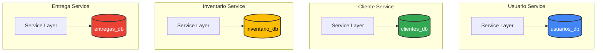
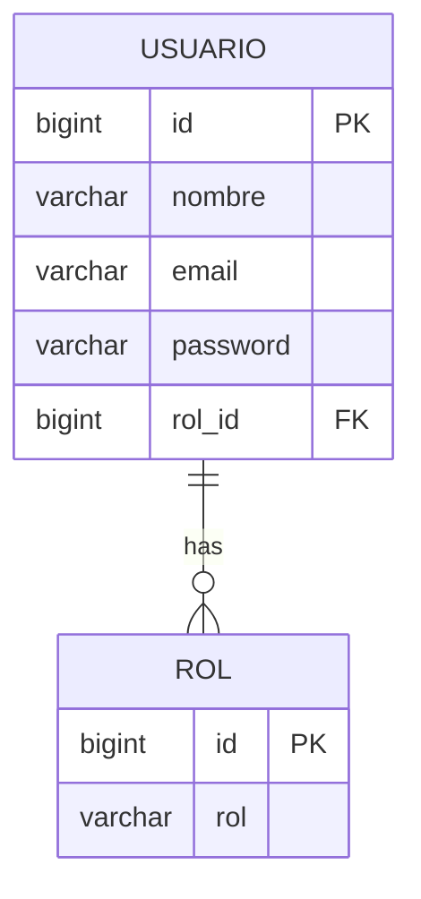
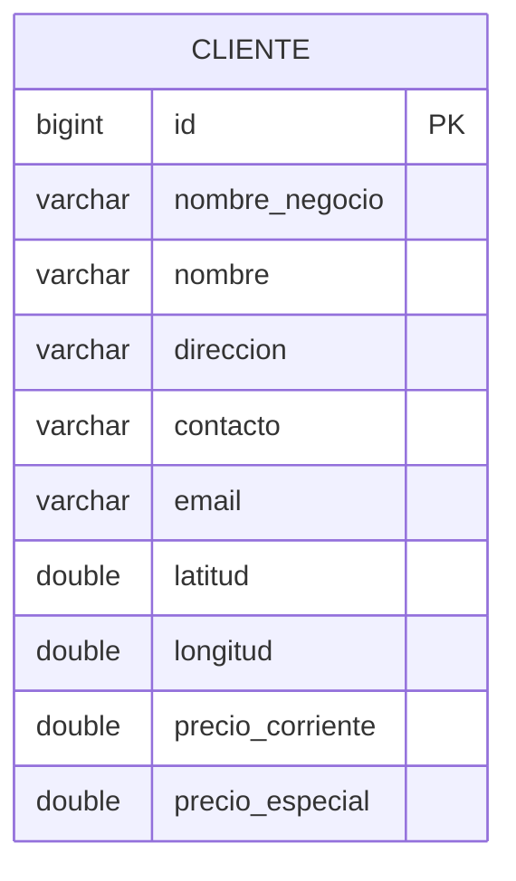
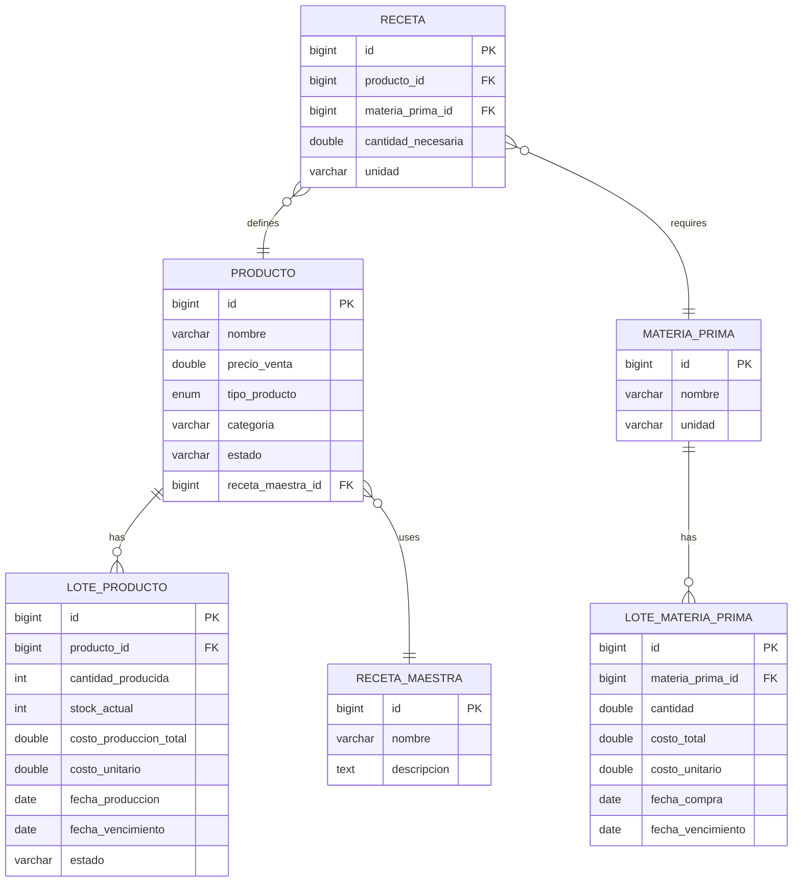
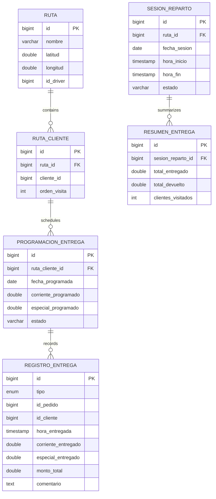
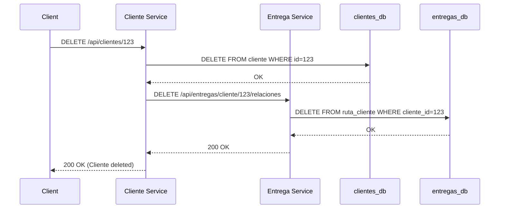

## Overview

Fluxora implements the **database-per-service** pattern, where each microservice owns its database with independent schemas. This ensures loose coupling, independent scalability, and autonomous deployment of services.

<Note>
  All microservices use **PostgreSQL** as the relational database with JPA/Hibernate for object-relational mapping.
</Note>

## Database-Per-Service Pattern



### Benefits

<CardGroup cols={2}>
  <Card title="Service Independence" icon="circle-nodes">
    Each service can evolve its schema without coordinating with others
  </Card>
  <Card title="Technology Diversity" icon="layer-group">
    Services can use different database technologies (PostgreSQL, MongoDB, etc.)
  </Card>
  <Card title="Scalability" icon="chart-line">
    Scale databases independently based on service load
  </Card>
  <Card title="Fault Isolation" icon="shield-halved">
    Database failure in one service doesn't affect others
  </Card>
</CardGroup>

### Trade-offs

<Warning>
  The database-per-service pattern introduces challenges:
</Warning>

- **No Foreign Keys Across Services**: Cannot use referential integrity constraints between services
- **Distributed Queries**: Joining data from multiple services requires application-level logic
- **Data Consistency**: Must implement eventual consistency patterns
- **Transaction Management**: Cannot use ACID transactions across services (requires Saga pattern)

## Database Configuration

Each microservice configures its PostgreSQL connection:

```properties
spring.config.import=optional:file:.env[.properties]

spring.datasource.url=${DB_URL}
spring.datasource.username=${DB_USERNAME}
spring.datasource.password=${DB_PASSWORD}
spring.datasource.driver-class-name=org.postgresql.Driver

# JPA Configuration
spring.jpa.database-platform=org.hibernate.dialect.PostgreSQLDialect
spring.jpa.hibernate.ddl-auto=update
spring.jpa.properties.hibernate.format_sql=true
```

**Source**: `~/workspace/source/Microservicios/microservice-cliente/src/main/resources/application.properties:6`

### Configuration Properties

| Property | Description | Example |
|----------|-------------|----------|
| `spring.datasource.url` | JDBC connection URL | `jdbc:postgresql://localhost:5432/clientes_db` |
| `spring.datasource.username` | Database username | `fluxora_user` |
| `spring.datasource.password` | Database password | Stored in `.env` file |
| `spring.jpa.hibernate.ddl-auto` | Schema generation strategy | `update`, `create-drop`, `validate` |
| `spring.jpa.show-sql` | Log SQL statements (dev only) | `true` |

<Note>
  Environment variables (`${DB_URL}`, `${DB_USERNAME}`, `${DB_PASSWORD}`) are loaded from `.env` files for security.
</Note>

## Usuario Service Database

### Schema Overview

**Database**: `usuarios_db`

Manages user authentication and role-based access control.

### Entity: Usuario

```java
package com.microservice.usuario.entity;

import jakarta.persistence.Entity;
import jakarta.persistence.GeneratedValue;
import jakarta.persistence.GenerationType;
import jakarta.persistence.Id;
import jakarta.persistence.JoinColumn;
import jakarta.persistence.ManyToOne;
import lombok.AllArgsConstructor;
import lombok.Data;
import lombok.NoArgsConstructor;

@Entity
@Data
@NoArgsConstructor
@AllArgsConstructor
public class Usuario {

    @Id
    @GeneratedValue(strategy = GenerationType.IDENTITY)
    private Long id;

    private String nombre;
    private String email;
    private String password;  // BCrypt hashed

    @ManyToOne
    @JoinColumn(name = "rol_id", nullable = false)
    private Rol rol;
}
```

**Source**: `~/workspace/source/Microservicios/microservice-usuario/src/main/java/com/microservice/usuario/entity/Usuario.java:1`

### Entity: Rol

```java
@Entity
@Data
@NoArgsConstructor
@AllArgsConstructor
public class Rol {

    @Id
    @GeneratedValue(strategy = GenerationType.IDENTITY)
    private Long id;

    private String rol;  // e.g., "ADMIN", "DRIVER", "OPERATOR"
}
```

**Source**: `~/workspace/source/Microservicios/microservice-usuario/src/main/java/com/microservice/usuario/entity/Rol.java:1`

### ER Diagram



### Table: `usuario`

| Column | Type | Constraints | Description |
|--------|------|-------------|-------------|
| `id` | BIGINT | PRIMARY KEY, AUTO_INCREMENT | Unique user ID |
| `nombre` | VARCHAR(255) | NOT NULL | User's full name |
| `email` | VARCHAR(255) | NOT NULL, UNIQUE | User's email (login identifier) |
| `password` | VARCHAR(255) | NOT NULL | BCrypt hashed password |
| `rol_id` | BIGINT | NOT NULL, FOREIGN KEY → `rol.id` | Reference to user role |

### Table: `rol`

| Column | Type | Constraints | Description |
|--------|------|-------------|-------------|
| `id` | BIGINT | PRIMARY KEY, AUTO_INCREMENT | Unique role ID |
| `rol` | VARCHAR(50) | NOT NULL, UNIQUE | Role name (e.g., "ADMIN", "DRIVER") |

## Cliente Service Database

### Schema Overview

**Database**: `clientes_db`

Manages customer information with geographic coordinates for delivery routing.

### Entity: Cliente

```java
package com.microservice.cliente.entity;

import jakarta.persistence.Column;
import jakarta.persistence.Entity;
import jakarta.persistence.GeneratedValue;
import jakarta.persistence.GenerationType;
import jakarta.persistence.Id;
import lombok.AllArgsConstructor;
import lombok.Data;
import lombok.NoArgsConstructor;

@Entity
@Data
@NoArgsConstructor
@AllArgsConstructor
public class Cliente {

    @Id
    @GeneratedValue(strategy = GenerationType.IDENTITY)
    private Long id;

    private String nombreNegocio;
    private String nombre;
    private String direccion;
    private String contacto;
    private String email;

    // Geographic coordinates for routing
    @Column(name = "latitud")
    private Double latitud;

    @Column(name = "longitud")
    private Double longitud;

    // Custom pricing per client
    @Column(name = "precio_corriente")
    private Double precioCorriente;

    @Column(name = "precio_especial")
    private Double precioEspecial;

    // Utility method for OR-Tools integration
    public double[] getCoordenadas() {
        return new double[] { 
            latitud != null ? latitud : 0.0, 
            longitud != null ? longitud : 0.0 
        };
    }
}
```

**Source**: `~/workspace/source/Microservicios/microservice-cliente/src/main/java/com/microservice/cliente/entity/Cliente.java:1`

### ER Diagram



### Table: `cliente`

| Column | Type | Constraints | Description |
|--------|------|-------------|-------------|
| `id` | BIGINT | PRIMARY KEY, AUTO_INCREMENT | Unique client ID |
| `nombre_negocio` | VARCHAR(255) | | Business name |
| `nombre` | VARCHAR(255) | | Contact person name |
| `direccion` | VARCHAR(500) | | Physical address |
| `contacto` | VARCHAR(50) | | Phone number |
| `email` | VARCHAR(255) | | Email address |
| `latitud` | DOUBLE PRECISION | | Latitude for delivery routing |
| `longitud` | DOUBLE PRECISION | | Longitude for delivery routing |
| `precio_corriente` | DOUBLE PRECISION | | Custom price for "corriente" products (kg) |
| `precio_especial` | DOUBLE PRECISION | | Custom price for "especial" products (kg) |

<Note>
  Geographic coordinates (`latitud`, `longitud`) are used by the Entrega service's route optimization algorithm (OR-Tools).
</Note>

## Inventario Service Database

### Schema Overview

**Database**: `inventario_db`

Manages products, raw materials, recipes, and production batches with cost tracking.

### Entity: Producto

```java
@Entity
@Table(name = "productos")
@Data
@Builder
@NoArgsConstructor
@AllArgsConstructor
public class Producto {

    @Id
    @GeneratedValue(strategy = GenerationType.IDENTITY)
    private Long id;

    @Column(nullable = false)
    private String nombre;

    @Column(name = "precio_venta")
    private Double precioVenta;

    @Column(name = "tipo_producto")
    @Enumerated(EnumType.STRING)
    private TipoProducto tipoProducto; // CORRIENTE, ESPECIAL, NO_APLICA

    private String categoria; // panaderia, pasteleria, etc.
    private String estado; // activo, descontinuado, etc.
    
    @ManyToOne(fetch = FetchType.LAZY)
    @JoinColumn(name = "receta_maestra_id")
    private RecetaMaestra recetaMaestra;

    public enum TipoProducto {
        CORRIENTE,
        ESPECIAL,
        NO_APLICA
    }
}
```

**Source**: `~/workspace/source/Microservicios/microservice-inventario/src/main/java/com/microservice/entity/Producto.java:1`

### Entity: MateriaPrima

```java
@Entity
@Table(name = "materias_primas")
@Data
@Builder
@NoArgsConstructor
@AllArgsConstructor
public class MateriaPrima {

    @Id
    @GeneratedValue(strategy = GenerationType.IDENTITY)
    private Long id;
    
    private String nombre;
    private String unidad; // kg, liters, units
}
```

**Source**: `~/workspace/source/Microservicios/microservice-inventario/src/main/java/com/microservice/entity/MateriaPrima.java:1`

### Entity: LoteProducto

```java
@Entity
@Table(name = "lotes_producto")
@Data
@Builder
@NoArgsConstructor
@AllArgsConstructor
public class LoteProducto {

    @Id
    @GeneratedValue(strategy = GenerationType.IDENTITY)
    private Long id;

    @Column(name = "producto_id", nullable = false)
    private Long productoId;

    @Column(name = "cantidad_producida", nullable = false)
    private Integer cantidadProducida;

    @Column(name = "stock_actual", nullable = false)
    private Integer stockActual;

    @Column(name = "costo_produccion_total", nullable = false)
    private Double costoProduccionTotal;

    @Column(name = "costo_unitario", nullable = false)
    private Double costoUnitario;

    @Column(name = "fecha_produccion", nullable = false)
    private LocalDate fechaProduccion;

    @Column(name = "fecha_vencimiento")
    private LocalDate fechaVencimiento;

    private String estado; // disponible, agotado, vencido

    @Transient
    public Double getGananciaUnitaria(Double precioVenta) {
        return (precioVenta != null && costoUnitario != null) 
            ? precioVenta - costoUnitario : 0.0;
    }
}
```

**Source**: `~/workspace/source/Microservicios/microservice-inventario/src/main/java/com/microservice/entity/LoteProducto.java:1`

### Entity: Receta

```java
@Entity
@Table(name = "recetas")
@Data
@Builder
@NoArgsConstructor
@AllArgsConstructor
public class Receta {

    @Id
    @GeneratedValue(strategy = GenerationType.IDENTITY)
    private Long id;
    
    @Column(name = "producto_id")
    private Long productoId;
    
    @Column(name = "materia_prima_id")
    private Long materiaPrimaId;
    
    @Column(name = "cantidad_necesaria")
    private Double cantidadNecesaria;
    
    private String unidad;
}
```

**Source**: `~/workspace/source/Microservicios/microservice-inventario/src/main/java/com/microservice/entity/Receta.java:1`

### ER Diagram



### Key Tables

<AccordionGroup>
  <Accordion title="productos" icon="box">
    Catalog of all bakery products (bread, pastries, cakes)
    
    **Relationships**:
    - One-to-many with `lotes_producto`
    - Many-to-one with `receta_maestra`
  </Accordion>
  
  <Accordion title="lotes_producto" icon="layer-group">
    Production batches tracking quantity, cost, and profitability
    
    **Key Features**:
    - Tracks `stock_actual` (remaining inventory)
    - Calculates `costo_unitario` for profitability analysis
    - Manages expiration dates
  </Accordion>
  
  <Accordion title="materias_primas" icon="wheat">
    Raw material catalog (flour, sugar, butter, etc.)
    
    **Note**: Acts as a catalog; actual inventory is in `lotes_materia_prima`
  </Accordion>
  
  <Accordion title="recetas" icon="book">
    Product recipes linking products to required raw materials
    
    **Example**: "Pan Corriente" requires 0.5 kg flour, 0.01 kg yeast
  </Accordion>
  
  <Accordion title="lotes_materia_prima" icon="boxes-packing">
    Raw material inventory batches with cost tracking
    
    **Key Fields**: `cantidad`, `costo_total`, `costo_unitario`, `fecha_vencimiento`
  </Accordion>
</AccordionGroup>

## Entrega Service Database

### Schema Overview

**Database**: `entregas_db`

Manages delivery routes, scheduling, and delivery tracking.

### Entity: Ruta

```java
@Entity
@Data
@NoArgsConstructor
@AllArgsConstructor
public class Ruta {

    @Id
    @GeneratedValue(strategy = GenerationType.IDENTITY)
    private Long id;

    private String nombre;

    // Bakery origin coordinates
    @Column(name = "latitud")
    private Double latitud;

    @Column(name = "longitud")
    private Double longitud;

    private Long id_driver; // Reference to Usuario service
}
```

**Source**: `~/workspace/source/Microservicios/microservice-entrega/src/main/java/com/microservice/entrega/entity/Ruta.java:1`

### Entity: RegistroEntrega

```java
@Entity
@Data
@NoArgsConstructor
@AllArgsConstructor
public class RegistroEntrega {

    @Id
    @GeneratedValue(strategy = GenerationType.IDENTITY)
    private Long id;

    @Enumerated(EnumType.STRING)
    private TipoMovimiento tipo; // ENTREGA, DEVOLUCION
    
    private Long id_pedido;
    private Long id_cliente; // Reference to Cliente service
    private LocalDateTime hora_entregada;
    private Double corriente_entregado;
    private Double especial_entregado;
    private Double monto_corriente;
    private Double monto_especial;
    private Double monto_total;
    private String comentario;
}
```

**Source**: `~/workspace/source/Microservicios/microservice-entrega/src/main/java/com/microservice/entrega/entity/RegistroEntrega.java:1`

### ER Diagram



### Key Tables

<AccordionGroup>
  <Accordion title="ruta" icon="route">
    Delivery routes with origin coordinates (bakery location)
    
    **Foreign Reference**: `id_driver` references `usuario.id` in Usuario service
  </Accordion>
  
  <Accordion title="ruta_cliente" icon="map-pin">
    Associates clients with routes and defines visit order
    
    **Foreign Reference**: `cliente_id` references `cliente.id` in Cliente service
  </Accordion>
  
  <Accordion title="programacion_entrega" icon="calendar">
    Scheduled deliveries with planned quantities
    
    **States**: `PENDIENTE`, `EN_PROGRESO`, `COMPLETADA`, `CANCELADA`
  </Accordion>
  
  <Accordion title="registro_entrega" icon="clipboard-check">
    Actual delivery records with quantities and amounts
    
    **Types**: `ENTREGA` (delivery), `DEVOLUCION` (return)
  </Accordion>
  
  <Accordion title="sesion_reparto" icon="truck-fast">
    Delivery sessions tracking route execution
  </Accordion>
</AccordionGroup>

## Cross-Service Data Consistency

### Referential Integrity Without Foreign Keys

<Warning>
  Since services have separate databases, you cannot use database-level foreign key constraints across services.
</Warning>

**Example**: `RegistroEntrega.id_cliente` references `Cliente.id` but without a FK constraint.

### Compensating Actions

When data is deleted in one service, related data in other services must be cleaned up:

```java
// Cliente Service
public void deleteCliente(Long id) {
    // 1. Delete from local database
    clienteRepository.deleteById(id);
    
    // 2. Notify Entrega service to clean up routes
    entregaServiceClient.eliminarRelacionesCliente(id);
}
```

**Source**: `~/workspace/source/Microservicios/microservice-cliente/src/main/java/com/microservice/cliente/client/EntregaServiceClient.java:18`

### Eventual Consistency Pattern



<Note>
  If the Entrega service is unavailable, the Cliente service delete may succeed while leaving orphaned records in `ruta_cliente`. Implement retry logic or event-driven cleanup for robust consistency.
</Note>

## Migration Strategies

### Schema Versioning

Each microservice manages its own schema evolution:

```properties
# Development: Auto-update schema
spring.jpa.hibernate.ddl-auto=update

# Production: Validate schema only (use Flyway/Liquibase)
spring.jpa.hibernate.ddl-auto=validate
```

**Source**: `~/workspace/source/Microservicios/microservice-cliente/src/main/resources/application.properties:13`

### Flyway Migration Example

For production, use Flyway for versioned migrations:

```xml
<dependency>
    <groupId>org.flywaydb</groupId>
    <artifactId>flyway-core</artifactId>
</dependency>
```

**Migration file**: `src/main/resources/db/migration/V1__create_cliente_table.sql`

```sql
CREATE TABLE cliente (
    id BIGSERIAL PRIMARY KEY,
    nombre_negocio VARCHAR(255),
    nombre VARCHAR(255),
    direccion VARCHAR(500),
    contacto VARCHAR(50),
    email VARCHAR(255),
    latitud DOUBLE PRECISION,
    longitud DOUBLE PRECISION,
    precio_corriente DOUBLE PRECISION,
    precio_especial DOUBLE PRECISION
);
```

## Transaction Management

### Local Transactions

Each service uses Spring's `@Transactional` for local ACID transactions:

```java
@Service
public class ClienteService {
    
    @Transactional
    public Cliente createCliente(ClienteDTO dto) {
        // All operations within this method are atomic
        Cliente cliente = clienteMapper.toEntity(dto);
        return clienteRepository.save(cliente);
    }
}
```

### Distributed Transactions (Future Enhancement)

<Warning>
  Fluxora does not currently implement distributed transactions. For complex multi-service workflows, consider the **Saga pattern**.
</Warning>

**Saga Pattern Example**: Creating an order that updates Inventario and Entrega:

1. **Inventario Service**: Reserve stock
2. **Entrega Service**: Schedule delivery
3. **If failure**: Compensate by releasing reserved stock

## Performance Optimization

### Connection Pooling

Configure HikariCP (default in Spring Boot) for connection pooling:

```properties
spring.datasource.hikari.maximum-pool-size=10
spring.datasource.hikari.minimum-idle=5
spring.datasource.hikari.connection-timeout=30000
spring.datasource.hikari.idle-timeout=600000
```

### JPA Optimizations

```properties
# Batch inserts for better performance
spring.jpa.properties.hibernate.jdbc.batch_size=20
spring.jpa.properties.hibernate.order_inserts=true
spring.jpa.properties.hibernate.order_updates=true

# Second-level cache (optional)
spring.jpa.properties.hibernate.cache.use_second_level_cache=true
spring.jpa.properties.hibernate.cache.region.factory_class=org.hibernate.cache.jcache.JCacheRegionFactory
```

### Indexing Strategy

<Note>
  Create indexes on frequently queried columns:
</Note>

```sql
-- Cliente service
CREATE INDEX idx_cliente_email ON cliente(email);
CREATE INDEX idx_cliente_coords ON cliente(latitud, longitud);

-- Usuario service
CREATE UNIQUE INDEX idx_usuario_email ON usuario(email);

-- Inventario service
CREATE INDEX idx_producto_categoria ON productos(categoria, estado);
CREATE INDEX idx_lote_producto_id ON lotes_producto(producto_id);

-- Entrega service
CREATE INDEX idx_ruta_cliente_ruta_id ON ruta_cliente(ruta_id);
CREATE INDEX idx_registro_cliente_id ON registro_entrega(id_cliente);
```

## Backup and Disaster Recovery

### Database Backup Strategy

<Steps>
  <Step title="Regular Backups">
    Schedule automated PostgreSQL backups for each database:
    ```bash
    # Daily backup script
    pg_dump -U fluxora_user clientes_db > backup_clientes_$(date +%Y%m%d).sql
    pg_dump -U fluxora_user usuarios_db > backup_usuarios_$(date +%Y%m%d).sql
    pg_dump -U fluxora_user inventario_db > backup_inventario_$(date +%Y%m%d).sql
    pg_dump -U fluxora_user entregas_db > backup_entregas_$(date +%Y%m%d).sql
    ```
  </Step>
  
  <Step title="Point-in-Time Recovery">
    Enable PostgreSQL WAL archiving for point-in-time recovery:
    ```sql
    -- postgresql.conf
    wal_level = replica
    archive_mode = on
    archive_command = 'cp %p /backup/wal/%f'
    ```
  </Step>
  
  <Step title="Test Restores">
    Regularly test restore procedures to ensure backup integrity
  </Step>
</Steps>

## Monitoring Database Health

### Key Metrics

<CardGroup cols={2}>
  <Card title="Connection Pool Usage" icon="plug">
    Monitor active/idle connections to detect leaks
  </Card>
  <Card title="Query Performance" icon="gauge-high">
    Track slow queries (> 1 second) for optimization
  </Card>
  <Card title="Database Size" icon="database">
    Monitor disk usage and plan for scaling
  </Card>
  <Card title="Replication Lag" icon="clock">
    In HA setups, monitor replication delay
  </Card>
</CardGroup>

### Spring Boot Actuator

Enable database health checks:

```properties
management.endpoints.web.exposure.include=health,metrics
management.endpoint.health.show-details=always
```

**Health Check**: `GET /actuator/health`

```json
{
  "status": "UP",
  "components": {
    "db": {
      "status": "UP",
      "details": {
        "database": "PostgreSQL",
        "validationQuery": "isValid()"
      }
    }
  }
}
```

## Next Steps

<CardGroup cols={2}>
  <Card title="Microservices Architecture" icon="diagram-project" href="/development/microservices-architecture">
    Understand service boundaries and communication patterns
  </Card>
  <Card title="API Reference" icon="book" href="/api/overview">
    Explore database-backed API endpoints
  </Card>
  <Card title="Service Discovery" icon="magnifying-glass" href="/development/service-discovery">
    Configure Eureka for service registration
  </Card>
  <Card title="Getting Started" icon="rocket" href="/getting-started/installation">
    Set up local PostgreSQL databases
  </Card>
</CardGroup>