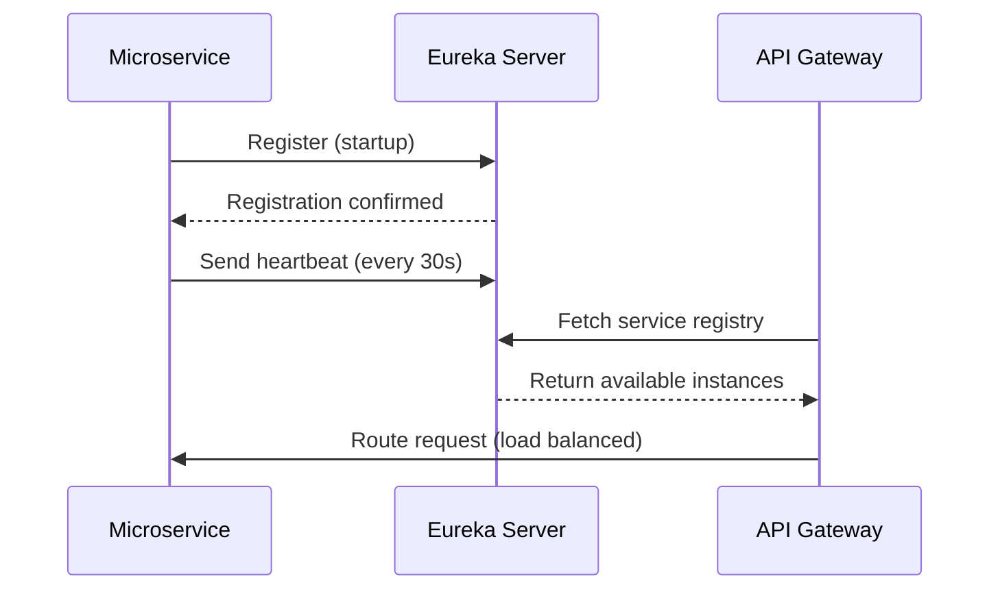

## Overview

Fluxora implements a microservices-based architecture using Spring Boot and Spring Cloud, decomposing the bakery management system into independently deployable services. Each microservice owns its domain logic and data, communicating through well-defined APIs.

## Architecture Principles

<CardGroup cols={2}>
  <Card title="Single Responsibility" icon="cube">
    Each microservice focuses on a specific business capability (users, clients, inventory, deliveries)
  </Card>
  <Card title="Database per Service" icon="database">
    Each service maintains its own PostgreSQL database with independent schemas
  </Card>
  <Card title="Decentralized Governance" icon="diagram-project">
    Services are independently deployable and scalable
  </Card>
  <Card title="API-First Design" icon="code">
    RESTful APIs with clear contracts between services
  </Card>
</CardGroup>

## Service Boundaries

Fluxora consists of the following core microservices:

<AccordionGroup>
  <Accordion title="Usuario Service (Port 8081)" icon="user">
    **Responsibility**: User authentication and authorization
    
    - User management (CRUD operations)
    - Role-based access control (RBAC)
    - JWT token generation and validation
    - Password encryption with BCrypt
    
    **Database**: `usuarios` database with `Usuario` and `Rol` tables
    
    **Key Endpoints**:
    - `POST /api/usuarios/auth/login` - User authentication
    - `GET /api/usuarios` - List all users
    - `POST /api/usuarios` - Create new user
  </Accordion>

  <Accordion title="Cliente Service (Port 8083)" icon="users">
    **Responsibility**: Client/customer management
    
    - Customer CRUD operations
    - Geographic coordinates for delivery routing
    - Custom pricing per client (corriente/especial)
    - Integration with Entrega service via Feign
    
    **Database**: `clientes` database with `Cliente` table
    
    **Key Endpoints**:
    - `GET /api/clientes` - List all clients
    - `POST /api/clientes` - Create new client
    - `DELETE /api/clientes/{id}` - Delete client (with cascading cleanup)
  </Accordion>

  <Accordion title="Inventario Service (Port 8082)" icon="boxes-stacked">
    **Responsibility**: Inventory and production management
    
    - Product catalog management
    - Raw material inventory (materias primas)
    - Recipe management (recetas)
    - Production batches (lotes)
    - Cost calculation and profitability analysis
    
    **Database**: `inventario` database with multiple tables:
    - `productos`, `materias_primas`
    - `lotes_producto`, `lotes_materia_prima`
    - `recetas`, `receta_ingrediente`, `receta_maestra`
    
    **Key Endpoints**:
    - `GET /api/inventario/productos` - List products
    - `POST /api/inventario/lotes` - Register production batch
    - `GET /api/inventario/materias-primas` - List raw materials
  </Accordion>

  <Accordion title="Entrega Service (Port 8084)" icon="truck">
    **Responsibility**: Delivery scheduling and route optimization
    
    - Delivery route management
    - Delivery scheduling (programación)
    - Delivery registration and tracking
    - Route optimization with OR-Tools
    - Email notifications via SMTP
    
    **Database**: `entregas` database with tables:
    - `ruta`, `ruta_cliente`
    - `programacion_entrega`, `registro_entrega`
    - `sesion_reparto`, `resumen_entrega`
    
    **Key Endpoints**:
    - `GET /api/entregas/rutas` - List delivery routes
    - `POST /api/entregas/programacion` - Schedule delivery
    - `GET /api/entregas/registros` - Delivery history
  </Accordion>
</AccordionGroup>

## Infrastructure Services

### Eureka Server (Port 8761)

<Note>
  Service discovery server enabling dynamic service registration and lookup
</Note>

**Configuration**:
```properties
spring.application.name=microservice-eureka
server.port=8761
eureka.client.register-with-eureka=false
eureka.client.fetch-registry=false
```

**Implementation**: `~/workspace/source/Microservicios/microservice-eureka/src/main/resources/application.properties:1`

### API Gateway (Port 8080)

<Note>
  Single entry point for all client requests, routing to appropriate microservices
</Note>

**Built with**: Spring Cloud Gateway (reactive WebFlux)

**Responsibilities**:
- Request routing to microservices
- CORS configuration
- Load balancing
- Service discovery integration

See [API Gateway Pattern](/development/api-gateway-pattern) for detailed configuration.

## Communication Patterns

### Synchronous Communication

<Steps>
  <Step title="REST APIs">
    All microservices expose RESTful endpoints over HTTP/HTTPS. Controllers use standard Spring annotations (`@RestController`, `@GetMapping`, etc.)
  </Step>
  
  <Step title="Feign Clients">
    Inter-service communication uses OpenFeign for declarative REST clients:
    
    ```java
    @FeignClient(name = "microservice-entrega", 
                 configuration = FeignClientInterceptor.class)
    public interface EntregaServiceClient {
        @DeleteMapping("/api/entregas/entrega/cliente/{idCliente}/relaciones")
        ResponseEntity<String> eliminarRelacionesCliente(
            @PathVariable("idCliente") Long idCliente);
    }
    ```
    
    **Source**: `~/workspace/source/Microservicios/microservice-cliente/src/main/java/com/microservice/cliente/client/EntregaServiceClient.java:15`
  </Step>
  
  <Step title="JWT Propagation">
    Authentication tokens are propagated between services using Feign interceptors for security context preservation.
  </Step>
</Steps>

### Asynchronous Communication

<Warning>
  Currently, Fluxora uses synchronous REST APIs. For high-volume operations, consider implementing message queues (RabbitMQ/Kafka) for event-driven architecture.
</Warning>

## Data Consistency Strategies

### Database Per Service Pattern

Each microservice maintains its own database with separate schemas:

```properties
# Usuario Service
spring.datasource.url=${DB_URL}  # usuarios database

# Cliente Service  
spring.datasource.url=${DB_URL}  # clientes database

# Inventario Service
spring.datasource.url=${DB_URL}  # inventario database

# Entrega Service
spring.datasource.url=${DB_URL}  # entregas database
```

### Eventual Consistency

<Note>
  When Cliente is deleted, the service calls EntregaServiceClient to clean up related delivery routes, ensuring referential integrity across services.
</Note>

**Example**: `~/workspace/source/Microservicios/microservice-cliente/src/main/java/com/microservice/cliente/client/EntregaServiceClient.java:18`

### Distributed Transactions

<Warning>
  Fluxora does not currently implement distributed transactions (2PC/Saga pattern). Data consistency relies on compensating actions and eventual consistency.
</Warning>

**Future Enhancement**: Consider implementing Saga pattern for complex multi-service transactions.

## Deployment Architecture

### Service Registration Flow



### Configuration

Each microservice registers with Eureka:

```properties
eureka.client.service-url.defaultZone=${EUREKA_URL}
eureka.client.fetch-registry=true
eureka.client.register-with-eureka=true
eureka.instance.prefer-ip-address=true
```

**Source**: `~/workspace/source/Microservicios/microservice-cliente/src/main/resources/application.properties:16`

## Technology Stack

<CardGroup cols={2}>
  <Card title="Spring Boot 3.5.4" icon="leaf">
    Framework for building microservices
  </Card>
  <Card title="Spring Cloud 2025.0.0" icon="cloud">
    Microservices infrastructure (Gateway, Eureka, Feign)
  </Card>
  <Card title="PostgreSQL" icon="database">
    Relational database for each service
  </Card>
  <Card title="Java 21" icon="java">
    Programming language and runtime
  </Card>
</CardGroup>

### Key Dependencies

```xml
<spring-cloud.version>2025.0.0</spring-cloud.version>

<!-- Service Discovery -->
<dependency>
    <groupId>org.springframework.cloud</groupId>
    <artifactId>spring-cloud-starter-netflix-eureka-client</artifactId>
</dependency>

<!-- Inter-service Communication -->
<dependency>
    <groupId>org.springframework.cloud</groupId>
    <artifactId>spring-cloud-starter-openfeign</artifactId>
</dependency>

<!-- Data Access -->
<dependency>
    <groupId>org.springframework.boot</groupId>
    <artifactId>spring-boot-starter-data-jpa</artifactId>
</dependency>
```

**Source**: `~/workspace/source/Microservicios/microservice-cliente/pom.xml:31`

## Best Practices Implemented

<Steps>
  <Step title="Domain-Driven Design">
    Services are organized around business capabilities (users, inventory, deliveries)
  </Step>
  
  <Step title="API Versioning">
    All endpoints use `/api/<domain>` prefix for consistent routing
  </Step>
  
  <Step title="Environment Configuration">
    Externalized configuration using environment variables (`.env` files)
    
    ```properties
    spring.config.import=optional:file:.env[.properties]
    ```
  </Step>
  
  <Step title="Health Checks">
    Eureka monitors service health via heartbeats (30-second intervals)
  </Step>
  
  <Step title="Security">
    JWT-based authentication with token propagation across services
  </Step>
</Steps>

## Challenges and Solutions

<AccordionGroup>
  <Accordion title="Data Consistency Across Services">
    **Challenge**: Maintaining referential integrity when data spans multiple services
    
    **Solution**: Implemented compensating actions (e.g., when deleting a client, call Entrega service to remove route associations)
  </Accordion>
  
  <Accordion title="Distributed Debugging">
    **Challenge**: Tracing requests across multiple services
    
    **Future Solution**: Implement distributed tracing (Spring Cloud Sleuth + Zipkin)
  </Accordion>
  
  <Accordion title="Service Dependencies">
    **Challenge**: Services depend on each other (Cliente → Entrega)
    
    **Solution**: Use circuit breakers and fallback mechanisms to handle service failures gracefully
  </Accordion>
</AccordionGroup>

## Next Steps

<CardGroup cols={2}>
  <Card title="Service Discovery" icon="magnifying-glass" href="/development/service-discovery">
    Configure Eureka for dynamic service registration
  </Card>
  <Card title="API Gateway" icon="gateway" href="/development/api-gateway-pattern">
    Set up routing and CORS in Spring Cloud Gateway
  </Card>
  <Card title="Database Design" icon="database" href="/development/database-design">
    Explore database schemas for each microservice
  </Card>
  <Card title="API Reference" icon="book" href="/api/overview">
    View complete API endpoint documentation
  </Card>
</CardGroup>