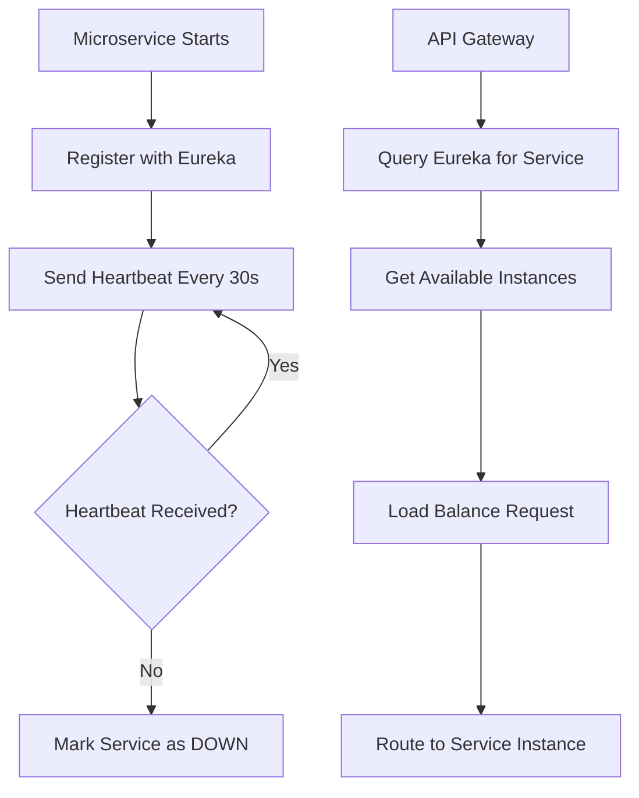
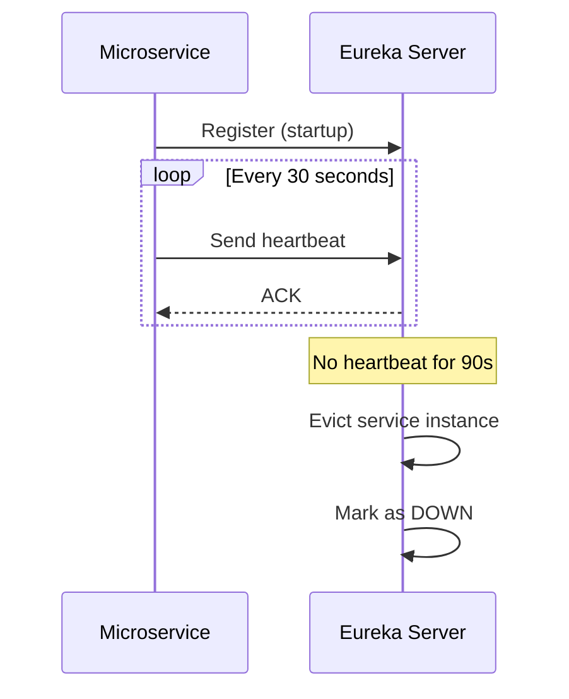

## Overview

Fluxora uses **Netflix Eureka** as its service discovery solution, enabling microservices to dynamically register themselves and discover other services without hardcoded URLs. This eliminates the need for manual configuration and enables scalable, resilient service-to-service communication.

<Note>
  Eureka Server runs on port **8761** and acts as a centralized registry for all microservices in the Fluxora ecosystem.
</Note>

## How Service Discovery Works



### Key Concepts

<CardGroup cols={2}>
  <Card title="Service Registration" icon="id-card">
    Microservices automatically register their network location when they start up
  </Card>
  <Card title="Health Checks" icon="heart-pulse">
    Services send periodic heartbeats to prove they're alive (default: every 30 seconds)
  </Card>
  <Card title="Service Discovery" icon="magnifying-glass">
    Clients query Eureka to find available instances of a service
  </Card>
  <Card title="Load Balancing" icon="scale-balanced">
    Multiple instances of a service are automatically load balanced
  </Card>
</CardGroup>

## Eureka Server Configuration

### Setup Steps

<Steps>
  <Step title="Add Eureka Server Dependency">
    Include Spring Cloud Netflix Eureka Server in your `pom.xml`:
    
    ```xml
    <properties>
        <spring-cloud.version>2025.0.0</spring-cloud.version>
    </properties>

    <dependencies>
        <dependency>
            <groupId>org.springframework.cloud</groupId>
            <artifactId>spring-cloud-starter-netflix-eureka-server</artifactId>
        </dependency>
    </dependencies>

    <dependencyManagement>
        <dependencies>
            <dependency>
                <groupId>org.springframework.cloud</groupId>
                <artifactId>spring-cloud-dependencies</artifactId>
                <version>${spring-cloud.version}</version>
                <type>pom</type>
                <scope>import</scope>
            </dependency>
        </dependencies>
    </dependencyManagement>
    ```
    
    **Source**: `~/workspace/source/Microservicios/microservice-eureka/pom.xml:31`
  </Step>
  
  <Step title="Enable Eureka Server">
    Annotate your main application class with `@EnableEurekaServer`:
    
    ```java
    package com.microservice.eureka;

    import org.springframework.boot.SpringApplication;
    import org.springframework.boot.autoconfigure.SpringBootApplication;
    import org.springframework.cloud.netflix.eureka.server.EnableEurekaServer;

    @EnableEurekaServer
    @SpringBootApplication
    public class MicroserviceEurekaApplication {
        public static void main(String[] args) {
            SpringApplication.run(MicroserviceEurekaApplication.class, args);
        }
    }
    ```
    
    **Source**: `~/workspace/source/Microservicios/microservice-eureka/src/main/java/com/microservice/eureka/MicroserviceEurekaApplication.java:7`
  </Step>
  
  <Step title="Configure Application Properties">
    Create `application.properties` for Eureka Server:
    
    ```properties
    spring.application.name=microservice-eureka
    server.port=8761
    spring.config.import=optional:configserver:http://localhost:8888

    # Eureka instance
    eureka.instance.hostname=eureka-server
    eureka.instance.prefer-ip-address=false

    # Eureka client (self-registration disabled)
    eureka.client.register-with-eureka=false
    eureka.client.fetch-registry=false
    eureka.client.service-url.defaultZone=http://eureka-server:${server.port}/eureka/
    ```
    
    **Source**: `~/workspace/source/Microservicios/microservice-eureka/src/main/resources/application.properties:1`
  </Step>
</Steps>

### Configuration Breakdown

<AccordionGroup>
  <Accordion title="register-with-eureka=false">
    Prevents the Eureka Server from registering itself as a client. Since it's the registry itself, it doesn't need to register.
  </Accordion>
  
  <Accordion title="fetch-registry=false">
    Disables fetching the registry from itself. The server maintains the registry, so it doesn't need to fetch it.
  </Accordion>
  
  <Accordion title="eureka.instance.hostname">
    The hostname that Eureka Server uses to identify itself. In containerized environments (Docker), use the service name.
  </Accordion>
  
  <Accordion title="server.port=8761">
    Default port for Eureka Server. Clients will connect to this port for registration and discovery.
  </Accordion>
</AccordionGroup>

## Microservice Registration (Client-Side)

### Cliente Service Example

<Steps>
  <Step title="Add Eureka Client Dependency">
    ```xml
    <dependency>
        <groupId>org.springframework.cloud</groupId>
        <artifactId>spring-cloud-starter-netflix-eureka-client</artifactId>
    </dependency>
    ```
    
    **Source**: `~/workspace/source/Microservicios/microservice-cliente/pom.xml:46`
  </Step>
  
  <Step title="Enable Discovery Client">
    Annotate your application with `@EnableDiscoveryClient`:
    
    ```java
    package com.microservice.cliente;

    import org.springframework.boot.SpringApplication;
    import org.springframework.boot.autoconfigure.SpringBootApplication;
    import org.springframework.cloud.client.discovery.EnableDiscoveryClient;
    import org.springframework.cloud.openfeign.EnableFeignClients;

    @SpringBootApplication
    @EnableFeignClients
    @EnableDiscoveryClient
    public class MicroserviceClienteApplication {
        public static void main(String[] args) {
            SpringApplication.run(MicroserviceClienteApplication.class, args);
        }
    }
    ```
    
    **Source**: `~/workspace/source/Microservicios/microservice-cliente/src/main/java/com/microservice/cliente/MicroserviceClienteApplication.java:10`
  </Step>
  
  <Step title="Configure Eureka Client Properties">
    ```properties
    spring.application.name=microservice-cliente
    server.port=${SERVER_PORT}
    
    # Eureka Configuration
    eureka.client.service-url.defaultZone=${EUREKA_URL}
    eureka.client.fetch-registry=true
    eureka.client.register-with-eureka=true
    eureka.instance.prefer-ip-address=true
    eureka.instance.hostname=microservice-cliente
    ```
    
    **Source**: `~/workspace/source/Microservicios/microservice-cliente/src/main/resources/application.properties:16`
  </Step>
</Steps>

### Client Configuration Properties

| Property | Value | Description |
|----------|-------|-------------|
| `eureka.client.service-url.defaultZone` | `${EUREKA_URL}` | Eureka Server endpoint (e.g., `http://eureka-server:8761/eureka/`) |
| `eureka.client.register-with-eureka` | `true` | Enable service registration with Eureka |
| `eureka.client.fetch-registry` | `true` | Download service registry for service discovery |
| `eureka.instance.prefer-ip-address` | `true` | Use IP address instead of hostname for registration |
| `eureka.instance.hostname` | Service name | Logical hostname for the service instance |

## All Registered Services

Fluxora microservices registered with Eureka:

<CardGroup cols={2}>
  <Card title="microservice-usuario" icon="user">
    **Port**: 8081  
    **Context**: `/api/usuarios`  
    **Function**: Authentication & user management
  </Card>
  
  <Card title="microservice-inventario" icon="boxes-stacked">
    **Port**: 8082  
    **Context**: `/api/inventario`  
    **Function**: Inventory & production management
  </Card>
  
  <Card title="microservice-cliente" icon="users">
    **Port**: 8083  
    **Context**: `/api/clientes`  
    **Function**: Customer management
  </Card>
  
  <Card title="microservice-entrega" icon="truck">
    **Port**: 8084  
    **Context**: `/api/entregas`  
    **Function**: Delivery routing & scheduling
  </Card>
</CardGroup>

### API Gateway Registration

```properties
spring.application.name=microservice-gateway
server.port=8080

eureka.client.service-url.defaultZone=http://eureka-server:8761/eureka/
eureka.client.fetch-registry=true
eureka.client.register-with-eureka=true
eureka.instance.prefer-ip-address=true
eureka.instance.ip-address=127.0.0.1
eureka.instance.hostname=localhost
```

**Source**: `~/workspace/source/Microservicios/microservice-gateway/src/main/resources/application.properties:36`

<Note>
  The API Gateway also registers with Eureka and fetches the registry to discover backend services for routing.
</Note>

## Health Checks and Heartbeats

### How Heartbeats Work



### Default Timing Configuration

| Setting | Default Value | Description |
|---------|---------------|-------------|
| **Heartbeat Interval** | 30 seconds | How often services send heartbeats |
| **Lease Renewal Interval** | 30 seconds | Server-side renewal interval |
| **Lease Expiration Duration** | 90 seconds | Time before eviction if no heartbeat |
| **Registry Fetch Interval** | 30 seconds | How often clients refresh service list |

### Custom Health Check Configuration

<Warning>
  In production environments, configure custom health check intervals for faster failure detection.
</Warning>

```properties
# Client-side configuration
eureka.instance.lease-renewal-interval-in-seconds=20
eureka.instance.lease-expiration-duration-in-seconds=60

# Server-side configuration (on Eureka Server)
eureka.server.eviction-interval-timer-in-ms=15000
eureka.server.renewal-threshold-update-interval-ms=15000
```

## Load Balancing with Eureka

When multiple instances of a service are registered, Eureka enables client-side load balancing:

### Example: Multiple Cliente Service Instances

```bash
# Instance 1
SERVER_PORT=8083 EUREKA_URL=http://eureka-server:8761/eureka/ \
  java -jar microservice-cliente.jar

# Instance 2
SERVER_PORT=8084 EUREKA_URL=http://eureka-server:8761/eureka/ \
  java -jar microservice-cliente.jar
```

Both instances register as `microservice-cliente`, and the Gateway/Feign clients automatically load-balance requests.

### Feign Client Load Balancing

```java
@FeignClient(name = "microservice-entrega", 
             configuration = FeignClientInterceptor.class)
public interface EntregaServiceClient {
    // Feign automatically resolves "microservice-entrega" via Eureka
    // and load-balances across available instances
    @GetMapping("/api/entregas/rutas")
    ResponseEntity<List<Ruta>> getRutas();
}
```

**Source**: `~/workspace/source/Microservicios/microservice-cliente/src/main/java/com/microservice/cliente/client/EntregaServiceClient.java:15`

## Accessing Eureka Dashboard

Eureka provides a web-based dashboard to monitor registered services:

<Steps>
  <Step title="Access the Dashboard">
    Open your browser and navigate to:
    ```
    http://localhost:8761
    ```
  </Step>
  
  <Step title="View Registered Services">
    The dashboard displays:
    - All registered application instances
    - Instance status (UP/DOWN)
    - Last heartbeat timestamp
    - Service URLs
  </Step>
  
  <Step title="Monitor Health">
    Check the "Instances currently registered with Eureka" section to verify all microservices are UP.
  </Step>
</Steps>

<Note>
  In production, secure the Eureka dashboard using Spring Security to prevent unauthorized access.
</Note>

## Troubleshooting

<AccordionGroup>
  <Accordion title="Service Not Appearing in Eureka" icon="circle-exclamation">
    **Possible Causes**:
    - Incorrect `eureka.client.service-url.defaultZone` URL
    - Firewall blocking port 8761
    - Service failed to start (`@EnableDiscoveryClient` missing)
    
    **Solution**:
    ```bash
    # Check connectivity to Eureka Server
    curl http://eureka-server:8761/eureka/apps
    
    # Verify service logs for registration errors
    grep "Eureka" application.log
    ```
  </Accordion>
  
  <Accordion title="Service Marked as DOWN" icon="circle-xmark">
    **Cause**: Heartbeat not reaching Eureka Server (service crashed or network issue)
    
    **Solution**:
    - Restart the microservice
    - Check network connectivity
    - Verify service health endpoint is responding
  </Accordion>
  
  <Accordion title="Self-Preservation Mode Warning" icon="triangle-exclamation">
    **Cause**: Eureka detects too many services are down (possible network partition)
    
    **Solution**: Eureka enters self-preservation mode to avoid evicting healthy services. This is normal in dev environments. Disable in development:
    
    ```properties
    # Eureka Server application.properties (dev only)
    eureka.server.enable-self-preservation=false
    ```
  </Accordion>
  
  <Accordion title="Feign Client Cannot Find Service" icon="magnifying-glass-minus">
    **Cause**: Service name mismatch between `@FeignClient(name=...)` and `spring.application.name`
    
    **Solution**: Ensure the Feign client name exactly matches the service's registered name:
    
    ```java
    // Must match spring.application.name=microservice-entrega
    @FeignClient(name = "microservice-entrega")
    ```
  </Accordion>
</AccordionGroup>

## Production Considerations

<Warning>
  For production deployments, implement these best practices:
</Warning>

<Steps>
  <Step title="Deploy Multiple Eureka Servers">
    Run at least 2-3 Eureka Server instances for high availability:
    
    ```properties
    # Eureka Server 1
    eureka.client.service-url.defaultZone=http://eureka2:8761/eureka/,http://eureka3:8761/eureka/
    
    # Eureka Server 2
    eureka.client.service-url.defaultZone=http://eureka1:8761/eureka/,http://eureka3:8761/eureka/
    ```
  </Step>
  
  <Step title="Enable HTTPS">
    Secure Eureka communication with TLS:
    ```properties
    server.ssl.enabled=true
    server.ssl.key-store=classpath:keystore.p12
    server.ssl.key-store-password=${KEYSTORE_PASSWORD}
    ```
  </Step>
  
  <Step title="Implement Authentication">
    Protect Eureka Server with Spring Security:
    ```xml
    <dependency>
        <groupId>org.springframework.boot</groupId>
        <artifactId>spring-boot-starter-security</artifactId>
    </dependency>
    ```
  </Step>
  
  <Step title="Monitor Registry Size">
    Set up alerts for registry changes (sudden increase/decrease in services)
  </Step>
</Steps>

## Next Steps

<CardGroup cols={2}>
  <Card title="API Gateway Pattern" icon="gateway" href="/development/api-gateway-pattern">
    Configure Spring Cloud Gateway to route requests to discovered services
  </Card>
  <Card title="Microservices Architecture" icon="diagram-project" href="/development/microservices-architecture">
    Understand the overall architecture and service boundaries
  </Card>
  <Card title="Database Design" icon="database" href="/development/database-design">
    Learn about database-per-service pattern implementation
  </Card>
  <Card title="Getting Started" icon="rocket" href="/getting-started/installation">
    Set up your local development environment
  </Card>
</CardGroup>